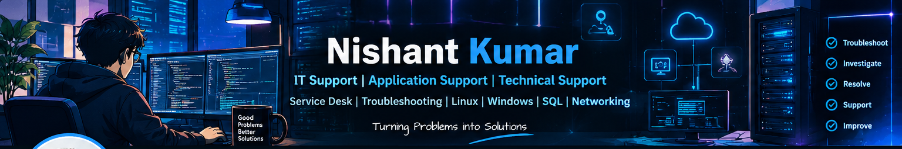

# 👋 Hi, I'm Nishant Kumar

### IT Support | Application Support | Technical Support | Service Desk

  
  

---

## 👨‍💻 About Me

I'm an **MCA graduate** focused on building my career in **IT Support, Application Support, Technical Support, and Service Desk** roles.

I enjoy troubleshooting technical issues, investigating application problems, working with databases and logs, and following structured **incident, ticket, and SLA management** processes.

I am passionate about solving real-world technical problems and continuously improving my knowledge of **Linux, Windows, SQL, Networking, REST APIs, Python, Cloud, and DevOps fundamentals**.

### 🎯 Career Goal

> **IT Support → Application Support → Production / Technical Support**

---

## 🛠️ Skills & Technologies

### 💻 Operating Systems

### 🎫 IT Support & Service Management

### 🌐 Networking & APIs

### 🗄️ Database & Scripting

### ☁️ Cloud & DevOps

---

## 🚀 Featured Projects

### 🎫 Enterprise IT Help Desk & Ticket Management System

A full-stack **IT Service Management** platform designed around real-world support workflows.

**Features**

- 🎫 Ticket creation & tracking
- ⏱️ SLA monitoring
- 👨‍💻 Technician dashboard
- 📊 Manager analytics
- 👤 Admin user management
- 📚 Knowledge base
- 🚨 SLA policies

**Tech Stack**

`React.js` `Vite` `Tailwind CSS` `Node.js` `Express` `Prisma` `PostgreSQL`

🔗 **[View Project →](https://github.com/Nishant27203/enterprise-it-helpdesk-system)**

---

### 🔎 Job Skill Gap Analyzer

An application that compares job requirements with candidate skills and identifies relevant skill gaps.

**Tech Stack**

`Python` `Data Processing` `Web Application`

🔗 **[View Project →](https://github.com/Nishant27203/job-skill-gap-analyzer)**

---

### 🌿 Plant Disease Detector

A computer-vision based application for identifying diseases in tomato leaves using image classification techniques.

**Tech Stack**

`Python` `Machine Learning` `Computer Vision`

🔗 **[View Project →](https://github.com/Nishant27203/plant-disease-detector)**

---

## 📊 GitHub Statistics

 

---

## 📚 Currently Learning

- 🐧 Advanced Linux Troubleshooting
- 🗄️ SQL for Application Support
- 🌐 Networking & Troubleshooting
- 🎫 ITIL & Incident Management
- 🔌 REST APIs & Application Monitoring
- ☁️ Cloud & DevOps Fundamentals

---

## 🔗 Connect With Me

---

### 💼 Open to Opportunities

**IT Support • Application Support • Technical Support • Service Desk**

 

⭐ *Turning technical problems into practical solutions.*

